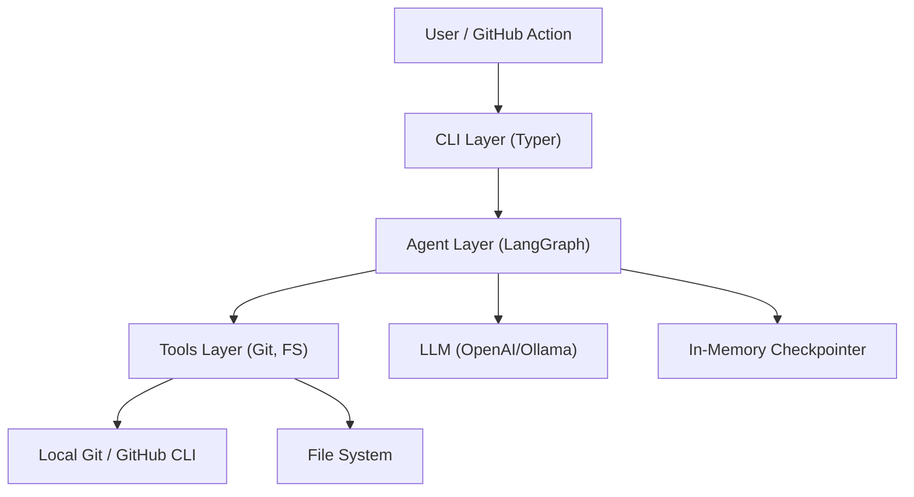
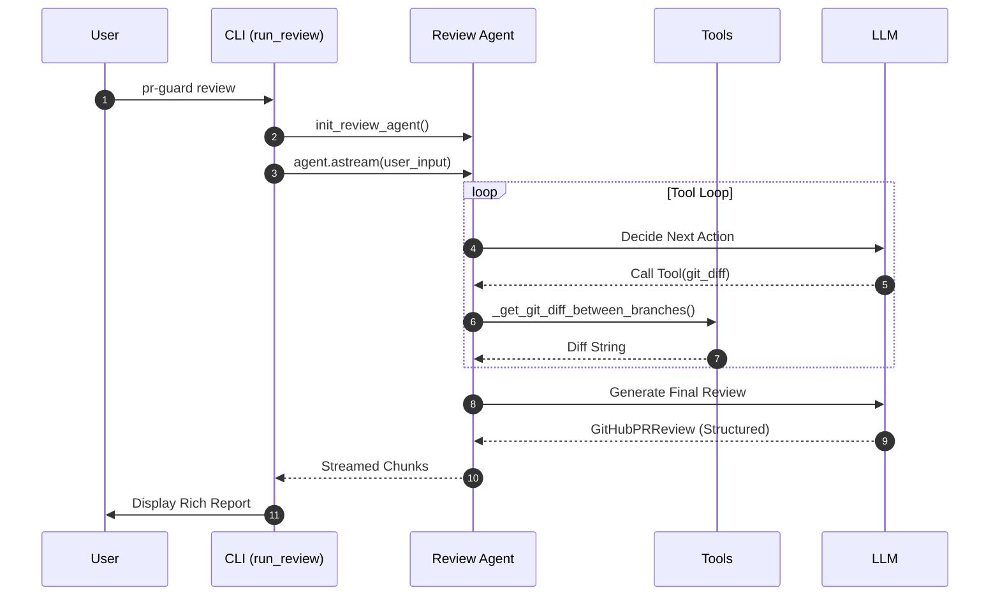
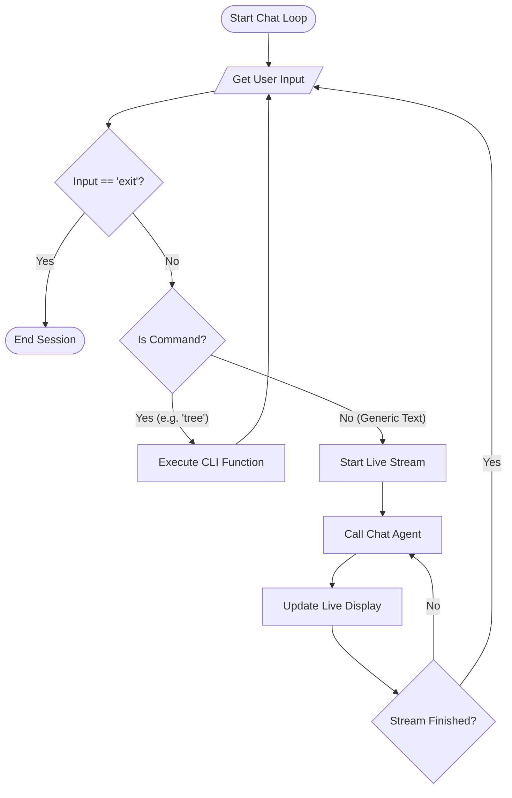

# 🏗️ PR Guard Architecture

This document provides a technical overview of how PR Guard is structured and how its components interact.

## 1. System Architecture
PR Guard follows a layered architecture connecting the CLI interface to AI agents and specialized tools.

---

## 2. Review Sequence Diagram
This diagram shows the flow of the `pr-guard review` command.

---

## 3. Chat Loop Flowchart
The interactive chat uses a stateful loop for multi-turn conversations.

---

## 4. Connection Details
- **CLI to Agent**: Communicates via `astream` for real-time reporting.
- **Agent to Tools**: Tools are defined in `src/pr_guard/tools.py` and passed to the agent during initialization.
- **Environment**: Sensitive data (keys, tokens) are managed via `.env` and `src/pr_guard/config.py`.
